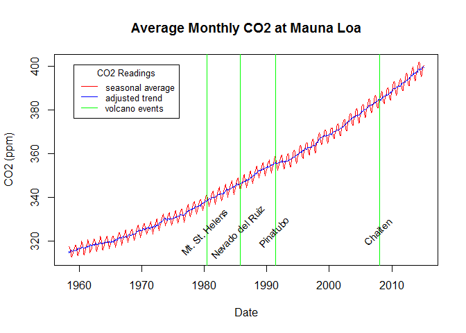
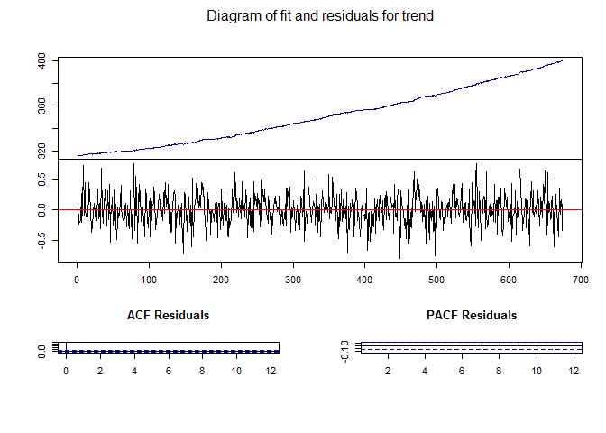
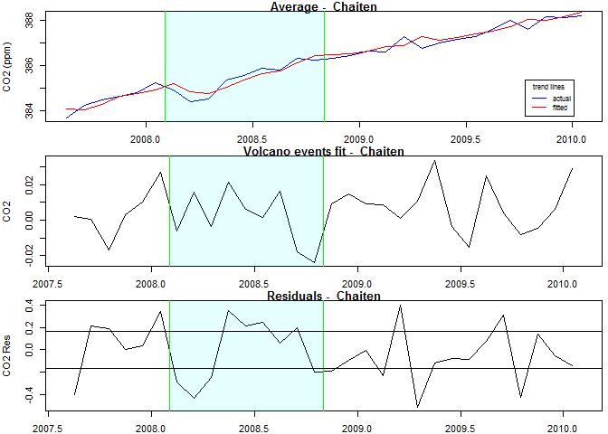

# Volcano CO² Preliminary Exploration
Daryl Hegyi  
Thursday, March 12, 2015  
## The Contribution of Volcanoes to Global Warming.
Given a continuous long-duration record of CO2 at a single location (Mauna Loa), and a list of volcano eruptions during the monitored period, determine the amount of CO2 injected into the atmosphere by each volcano, and use that information to quantify the CO2 that can be attributed to geological (volcanic) processes.

I set out to do this because many global warming deniers were claiming that volcanic eruptions spewed so much CO2 that it completely dominated the climate, and man's influence was negligible.  I wanted to explore the impact of volcanos on the CO2 record, to see if volcanos were indeed significant.


```
## Loading required package: MASS
## Loading required package: strucchange
## Loading required package: zoo
## 
## Attaching package: 'zoo'
## 
## The following objects are masked from 'package:base':
## 
##     as.Date, as.Date.numeric
## 
## Loading required package: sandwich
## Loading required package: urca
## Loading required package: lmtest
```
* CO2 data: <http://www.esrl.noaa.gov/gmd/ccgg/trends/#mlo_full> copied to ./data/ on Mar 5, 2015.

  The carbon dioxide data, measured as the mole fraction in dry air, on Mauna Loa constitute the longest record of direct measurements of CO2 in the atmosphere. They were started by C. David Keeling of the Scripps Institution of Oceanography in March of 1958 at a facility of the National Oceanic and Atmospheric Administration [Keeling, 1976]. NOAA started its own CO2 measurements in May of 1974, and they have run in parallel with those made by Scripps since then [Thoning, 1989]. The trend value represents the seasonally corrected data.

Data are reported as a dry mole fraction defined as the number of molecules of carbon dioxide divided by the number of molecules of dry air multiplied by one million (ppm). 

```r
co2 <- read.table("./data/co2_mm_mlo.txt", header=TRUE, quote="\"", na.strings = "-99.99")
names(co2)<-c("year", "month", "decimal_date", "average", "interpolated", "trend", "numdays")

#fixup the NA/s in average by using the interpolated values
co2.na<-is.na(co2$average)
co2$average[co2.na] <- co2$interpolated[co2.na]
rm(co2.na)
summary(co2)
```

```
##       year          month         decimal_date     average     
##  Min.   :1958   Min.   : 1.000   Min.   :1958   Min.   :312.7  
##  1st Qu.:1972   1st Qu.: 4.000   1st Qu.:1972   1st Qu.:327.7  
##  Median :1986   Median : 7.000   Median :1987   Median :348.1  
##  Mean   :1986   Mean   : 6.505   Mean   :1987   Mean   :350.4  
##  3rd Qu.:2000   3rd Qu.: 9.500   3rd Qu.:2001   3rd Qu.:370.5  
##  Max.   :2015   Max.   :12.000   Max.   :2015   Max.   :401.8  
##   interpolated       trend          numdays     
##  Min.   :312.7   Min.   :314.7   Min.   :-1.00  
##  1st Qu.:327.7   1st Qu.:327.3   1st Qu.:-1.00  
##  Median :348.1   Median :347.7   Median :28.00  
##  Mean   :350.4   Mean   :350.4   Mean   :20.17  
##  3rd Qu.:370.5   3rd Qu.:370.3   3rd Qu.:30.00  
##  Max.   :401.8   Max.   :399.7   Max.   :31.00
```

* Loading up the Volcanos dataset

```r
vol.Classes <- c( "factor", "Date", "Date", "numeric")
vol <- read.csv("./data/Volcanos.csv", na.strings = "NA", colClasses=vol.Classes)

vol.na<-is.na(vol$EndEruption_date)
vol$EndEruption_date[vol.na] = vol$Eruption_date[vol.na]
rm(vol.na)

vol$erupted <- decimal_date(as.Date(vol$Eruption_date))
vol$duration <- decimal_date(as.Date(vol$EndEruption_date)) - vol$erupted
vol$duration[vol$duration==0] = .01 #if no duration set, default to one percent of a year (about 3.5 days)

## fix up the severity
vol$Severity[is.na(vol$Severity)] = 1

head(vol)
```

```
##              Name Eruption_date EndEruption_date Severity  erupted
## 1  Mt. St. Helens    1980-05-18       1980-05-18        1 1980.377
## 2 Nevado del Ruiz    1985-09-11       1985-11-13        1 1985.693
## 3        Pinatubo    1991-06-15       1991-06-27        1 1991.452
## 4         Chaiten    2008-02-02       2008-11-01        1 2008.087
##     duration
## 1 0.01000000
## 2 0.17260274
## 3 0.03287671
## 4 0.74590164
```

* merge volcano events into co2 data.


* Set up plot functions.

# Initial plot

** blue is the monthly average
** black is the trend
** green lines are the volcano eruptions.
 

## Using Vector Auto Regression (VAR) to extrapolate the trend and extract the residuals
After fitting a curve to the trend line, then subtracting the trend, the residuals should show some sort of activity due to the unit impulse of the volcano eruptions.  We should be able to readily visualize the magnitude of increase of CO2 due to volcano eruptions.

I've plotted the residuals with lines at the 25% and 75% quantiles, with the green volcano lines.  The logs are plotted (with an offset to avoid <= 0 and to emphasize positive trends).

```
## $selection
## AIC(n)  HQ(n)  SC(n) FPE(n) 
##      9      9      9      9 
## 
## $criteria
##                    1             2             3             4
## AIC(n) -2.230986e+01 -6.053548e+01 -5.957605e+01 -6.321063e+01
## HQ(n)  -2.224755e+01 -6.043164e+01 -5.943067e+01 -6.302371e+01
## SC(n)  -2.214897e+01 -6.026733e+01 -5.920063e+01 -6.272795e+01
## FPE(n)  2.046218e-10  5.125990e-27  1.338011e-26  3.531778e-28
##                    5             6             7             8
## AIC(n) -6.330664e+01 -6.354699e+01 -6.351121e+01 -6.377998e+01
## HQ(n)  -6.307818e+01 -6.327699e+01 -6.319968e+01 -6.342691e+01
## SC(n)  -6.271670e+01 -6.284978e+01 -6.270674e+01 -6.286825e+01
## FPE(n)  3.208592e-28  2.523251e-28  2.615367e-28  1.999191e-28
##                    9            10
## AIC(n) -1.066526e+02 -1.066190e+02
## HQ(n)  -1.062580e+02 -1.061828e+02
## SC(n)  -1.056336e+02 -1.054927e+02
## FPE(n)  4.803615e-47  4.968739e-47
```

```
## 
## VAR Estimation Results:
## ======================= 
## 
## Estimated coefficients for equation decimal_date: 
## ================================================= 
## Call:
## decimal_date = decimal_date.l1 + month.l1 + volcano.events.l1 + trend.l1 + decimal_date.l2 + month.l2 + volcano.events.l2 + trend.l2 + decimal_date.l3 + month.l3 + volcano.events.l3 + trend.l3 + decimal_date.l4 + month.l4 + volcano.events.l4 + trend.l4 + decimal_date.l5 + month.l5 + volcano.events.l5 + trend.l5 + decimal_date.l6 + month.l6 + volcano.events.l6 + trend.l6 + decimal_date.l7 + month.l7 + volcano.events.l7 + trend.l7 + decimal_date.l8 + month.l8 + volcano.events.l8 + trend.l8 + decimal_date.l9 + month.l9 + volcano.events.l9 + trend.l9 + const + trend 
## 
##   decimal_date.l1          month.l1 volcano.events.l1          trend.l1 
##      1.000000e+00     -1.125096e-13     -4.332187e-13     -2.455102e-13 
##   decimal_date.l2          month.l2 volcano.events.l2          trend.l2 
##      4.021137e-10      1.338244e-15     -4.807087e-13      8.512516e-13 
##   decimal_date.l3          month.l3 volcano.events.l3          trend.l3 
##      1.000000e+00     -1.137207e-13     -6.259835e-16     -1.257231e-13 
##   decimal_date.l4          month.l4 volcano.events.l4          trend.l4 
##     -1.000000e+00      7.457850e-15      3.700160e-13     -6.782379e-13 
##   decimal_date.l5          month.l5 volcano.events.l5          trend.l5 
##                NA     -8.954379e-15      5.601761e-13     -1.341427e-12 
##   decimal_date.l6          month.l6 volcano.events.l6          trend.l6 
##                NA     -1.116624e-13     -8.326027e-13      9.518119e-13 
##   decimal_date.l7          month.l7 volcano.events.l7          trend.l7 
##                NA      3.425276e-15     -6.733735e-13      4.478607e-13 
##   decimal_date.l8          month.l8 volcano.events.l8          trend.l8 
##                NA     -3.280469e-15      2.413875e-13      7.855019e-13 
##   decimal_date.l9          month.l9 volcano.events.l9          trend.l9 
##                NA     -1.075941e-13      3.965814e-13     -7.451868e-13 
##             const             trend 
##                NA                NA 
## 
## 
## Estimated coefficients for equation month: 
## ========================================== 
## Call:
## month = decimal_date.l1 + month.l1 + volcano.events.l1 + trend.l1 + decimal_date.l2 + month.l2 + volcano.events.l2 + trend.l2 + decimal_date.l3 + month.l3 + volcano.events.l3 + trend.l3 + decimal_date.l4 + month.l4 + volcano.events.l4 + trend.l4 + decimal_date.l5 + month.l5 + volcano.events.l5 + trend.l5 + decimal_date.l6 + month.l6 + volcano.events.l6 + trend.l6 + decimal_date.l7 + month.l7 + volcano.events.l7 + trend.l7 + decimal_date.l8 + month.l8 + volcano.events.l8 + trend.l8 + decimal_date.l9 + month.l9 + volcano.events.l9 + trend.l9 + const + trend 
## 
##   decimal_date.l1          month.l1 volcano.events.l1          trend.l1 
##      1.040000e+02      6.923359e-11     -1.832373e-10      1.868178e-10 
##   decimal_date.l2          month.l2 volcano.events.l2          trend.l2 
##      4.000000e+03     -1.267946e-11     -2.235292e-12     -7.147701e-10 
##   decimal_date.l3          month.l3 volcano.events.l3          trend.l3 
##     -8.000000e+03     -1.000000e+00      2.319169e-10      2.655505e-10 
##   decimal_date.l4          month.l4 volcano.events.l4          trend.l4 
##      3.896000e+03      2.272897e-12     -3.770080e-10      3.655055e-10 
##   decimal_date.l5          month.l5 volcano.events.l5          trend.l5 
##                NA     -6.246445e-12     -2.751270e-10      8.646032e-10 
##   decimal_date.l6          month.l6 volcano.events.l6          trend.l6 
##                NA     -1.000000e+00      3.958005e-10     -7.671257e-10 
##   decimal_date.l7          month.l7 volcano.events.l7          trend.l7 
##                NA      1.281634e-11     -4.490768e-10     -1.288938e-10 
##   decimal_date.l8          month.l8 volcano.events.l8          trend.l8 
##                NA      2.724271e-12     -5.485217e-10     -4.197586e-10 
##   decimal_date.l9          month.l9 volcano.events.l9          trend.l9 
##                NA     -1.000000e+00     -1.061930e-10      4.098653e-10 
##             const             trend 
##                NA                NA 
## 
## 
## Estimated coefficients for equation volcano.events: 
## =================================================== 
## Call:
## volcano.events = decimal_date.l1 + month.l1 + volcano.events.l1 + trend.l1 + decimal_date.l2 + month.l2 + volcano.events.l2 + trend.l2 + decimal_date.l3 + month.l3 + volcano.events.l3 + trend.l3 + decimal_date.l4 + month.l4 + volcano.events.l4 + trend.l4 + decimal_date.l5 + month.l5 + volcano.events.l5 + trend.l5 + decimal_date.l6 + month.l6 + volcano.events.l6 + trend.l6 + decimal_date.l7 + month.l7 + volcano.events.l7 + trend.l7 + decimal_date.l8 + month.l8 + volcano.events.l8 + trend.l8 + decimal_date.l9 + month.l9 + volcano.events.l9 + trend.l9 + const + trend 
## 
##   decimal_date.l1          month.l1 volcano.events.l1          trend.l1 
##     -1.014709e+01      1.219437e-03      5.664011e-04     -2.136637e-03 
##   decimal_date.l2          month.l2 volcano.events.l2          trend.l2 
##     -3.936445e+00      1.840065e-04      7.517374e-05      1.884820e-02 
##   decimal_date.l3          month.l3 volcano.events.l3          trend.l3 
##      1.072644e+01      1.374348e-03     -8.168168e-03     -1.897771e-02 
##   decimal_date.l4          month.l4 volcano.events.l4          trend.l4 
##      3.358376e+00     -3.215819e-03     -4.454837e-03     -1.236480e-02 
##   decimal_date.l5          month.l5 volcano.events.l5          trend.l5 
##                NA      3.247618e-03     -1.088761e-02      1.660790e-02 
##   decimal_date.l6          month.l6 volcano.events.l6          trend.l6 
##                NA      1.201452e-03     -1.006252e-02      3.404171e-03 
##   decimal_date.l7          month.l7 volcano.events.l7          trend.l7 
##                NA     -1.518928e-03     -2.426457e-03     -2.304214e-04 
##   decimal_date.l8          month.l8 volcano.events.l8          trend.l8 
##                NA      1.566695e-03     -3.400411e-03     -1.126212e-02 
##   decimal_date.l9          month.l9 volcano.events.l9          trend.l9 
##                NA      1.278873e-03     -1.006373e-02      5.316898e-03 
##             const             trend 
##                NA                NA 
## 
## 
## Estimated coefficients for equation trend: 
## ========================================== 
## Call:
## trend = decimal_date.l1 + month.l1 + volcano.events.l1 + trend.l1 + decimal_date.l2 + month.l2 + volcano.events.l2 + trend.l2 + decimal_date.l3 + month.l3 + volcano.events.l3 + trend.l3 + decimal_date.l4 + month.l4 + volcano.events.l4 + trend.l4 + decimal_date.l5 + month.l5 + volcano.events.l5 + trend.l5 + decimal_date.l6 + month.l6 + volcano.events.l6 + trend.l6 + decimal_date.l7 + month.l7 + volcano.events.l7 + trend.l7 + decimal_date.l8 + month.l8 + volcano.events.l8 + trend.l8 + decimal_date.l9 + month.l9 + volcano.events.l9 + trend.l9 + const + trend 
## 
##   decimal_date.l1          month.l1 volcano.events.l1          trend.l1 
##     -30.811329159       0.006118899      -0.103661219       0.587146673 
##   decimal_date.l2          month.l2 volcano.events.l2          trend.l2 
##     -78.627263842      -0.006029196      -0.410165051       0.224603217 
##   decimal_date.l3          month.l3 volcano.events.l3          trend.l3 
##      25.830913827       0.001208385      -0.163549692       0.050678813 
##   decimal_date.l4          month.l4 volcano.events.l4          trend.l4 
##      83.617893216       0.008945215       0.192211766       0.032353432 
##   decimal_date.l5          month.l5 volcano.events.l5          trend.l5 
##                NA      -0.009782794      -0.095493584       0.120226573 
##   decimal_date.l6          month.l6 volcano.events.l6          trend.l6 
##                NA       0.005045171      -0.052351078      -0.005352454 
##   decimal_date.l7          month.l7 volcano.events.l7          trend.l7 
##                NA       0.005430496      -0.085314927      -0.014143617 
##   decimal_date.l8          month.l8 volcano.events.l8          trend.l8 
##                NA      -0.006578253       0.164923074       0.026211590 
##   decimal_date.l9          month.l9 volcano.events.l9          trend.l9 
##                NA       0.004954538       0.099219858      -0.025930661 
##             const             trend 
##                NA                NA
```

     

## Zoom in on the volcano timeframes
Showing the CO2 Residuals from 1/2 year prior to the eruption until 2 years after the event started.

* The green-bordered cyan boxes show the estimated duration of the event.
* The 25% and 75% quantiles are shown.
    

## Summary
There does seem to be some activity due to the volcanic eruptions, but the overall effect is suble, and more research is necessary to extract some sort of quantitative information from the slight signal.  Whether it can be isolated to statistical significance remains to be discovered.
