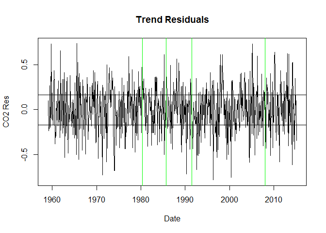
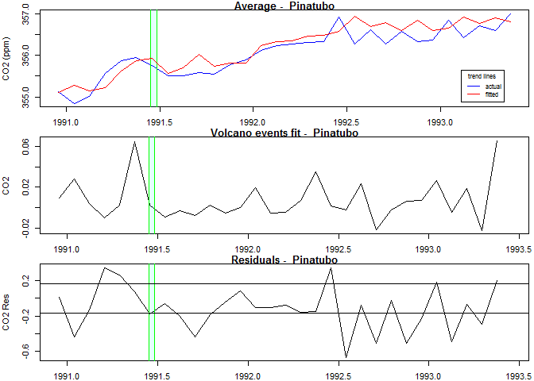

# Volcano CO² Preliminary Exploration
Daryl Hegyi  
Thursday, March 12, 2015  
## The Contribution of Volcanoes to Global Warming.
Given a continuous long-duration record of CO2 at a single location (Mauna Loa), and a list of volcano eruptions during the monitored period, determine the amount of CO2 injected into the atmosphere by each volcano, and use that information to quantify the CO2 that can be attributed to geological (volcanic) processes.

I set out to do this because many global warming deniers were claiming that volcanic eruptions spewed so much CO2 that it completely dominated the climate, and man's influence was negligible.  I wanted to explore the impact of volcanos on the CO2 record, to see if volcanos were indeed significant.

Please note that this is a work-product, and in no way constitutes a final form,
nor claim not to bore you with dry statistics and droll commentary.


```r
library(scales, quietly=TRUE, warn.conflicts=FALSE)
library(lubridate, quietly=TRUE, warn.conflicts=FALSE)
library(vars, quietly=TRUE, warn.conflicts=FALSE)
```

```
## Loading required package: zoo
## 
## Attaching package: 'zoo'
## 
## The following objects are masked from 'package:base':
## 
##     as.Date, as.Date.numeric
## 
## Loading required package: sandwich
```

```r
options(width=75)
```
## About the Data

* CO2 data: <http://www.esrl.noaa.gov/gmd/ccgg/trends/#mlo_full> copied to ./data/ on Mar 5, 2015.

  The carbon dioxide data, measured as the mole fraction in dry air, on Mauna Loa constitute the longest record of direct measurements of CO2 in the atmosphere. They were started by C. David Keeling of the Scripps Institution of Oceanography in March of 1958 at a facility of the National Oceanic and Atmospheric Administration [Keeling, 1976]. NOAA started its own CO2 measurements in May of 1974, and they have run in parallel with those made by Scripps since then [Thoning, 1989]. The trend value represents the seasonally corrected data.

Data are reported as a dry mole fraction defined as the number of molecules of carbon dioxide divided by the number of molecules of dry air multiplied by one million (ppm). 

[How the data is measured and recorded.](http://www.esrl.noaa.gov/gmd/ccgg/about/co2_measurements.html)

### Quick view of the data:

```
##   year month decimal_date average interpolated  trend numdays
## 1 1958     4     1958.292  317.45       317.45 315.29      -1
## 2 1958     5     1958.375  317.50       317.50 314.71      -1
## 3 1958     6     1958.458  317.10       317.10 314.85      -1
```

```
##     year month decimal_date average interpolated  trend numdays
## 681 2014    12     2014.958  398.78       398.78 399.57      30
## 682 2015     1     2015.042  399.96       399.96 399.72      30
## 683 2015     2     2015.125  400.26       400.26 399.50      27
```

```
##       year          month         decimal_date     average     
##  Min.   :1958   Min.   : 1.000   Min.   :1958   Min.   :312.7  
##  1st Qu.:1972   1st Qu.: 4.000   1st Qu.:1972   1st Qu.:327.7  
##  Median :1986   Median : 7.000   Median :1987   Median :348.1  
##  Mean   :1986   Mean   : 6.505   Mean   :1987   Mean   :350.4  
##  3rd Qu.:2000   3rd Qu.: 9.500   3rd Qu.:2001   3rd Qu.:370.5  
##  Max.   :2015   Max.   :12.000   Max.   :2015   Max.   :401.8  
##   interpolated       trend          numdays     
##  Min.   :312.7   Min.   :314.7   Min.   :-1.00  
##  1st Qu.:327.7   1st Qu.:327.3   1st Qu.:-1.00  
##  Median :348.1   Median :347.7   Median :28.00  
##  Mean   :350.4   Mean   :350.4   Mean   :20.17  
##  3rd Qu.:370.5   3rd Qu.:370.3   3rd Qu.:30.00  
##  Max.   :401.8   Max.   :399.7   Max.   :31.00
```

* Loading the Volcanos dataset

```
##              Name Eruption_date EndEruption_date Severity  erupted
## 1  Mt. St. Helens    1980-05-18       1980-05-18        1 1980.377
## 2 Nevado del Ruiz    1985-09-11       1985-11-13        1 1985.693
## 3        Pinatubo    1991-06-15       1991-06-27        1 1991.452
## 4         Chaiten    2008-02-02       2008-11-01        1 2008.087
##     duration
## 1 0.01000000
## 2 0.17260274
## 3 0.03287671
## 4 0.74590164
```

* merge volcano events into co2 data.

The volcano events are added to a vector (initially set to 0's) alongside the trend.


* Set up plot functions.

# Initial plot

First look at the data.  We see a rising curve, with a definite seasonal aspect.  The guys at NOAA have conveniently seasonally adjusted the data.  I have included lines (green) for some major volcano events.
 

## Using Vector Auto Regression (VAR)

This is heavy-duty statistics, which fortunately, does all the heavy lifting.  
I'm using the decimal date, the month, and the volcano events to predict the trend.  
I can show you the results, but like making sausages, it would probably make you queasy.


## Plot the Residuals

In order to see if there is any information left, I've plotted the residuals and the logarithm of the residuals with lines at the 25% and 75% quantiles, along with the green volcano lines.  The logs are plotted (with an offset to avoid <= 0)  to emphasize positive trends).
 

## Zoom in on the volcano timeframes
Showing the model fit for the eruption events and CO2 Residuals from 1/2 year prior to the eruption until 2 years after the event started.

* The green-bordered cyan boxes show the estimated duration of the event.
* The 25% and 75% quantiles are shown.
    

## Summary

There does seem to be some activity due to the volcanic eruptions.  
This is especially visible in the volcano events fit for Mt. St. Helens.  
The overall effect is suble, and more research is necessary to extract some sort of quantitative information from the slight signal.  Whether it can be isolated to statistical significance remains to be discovered.


